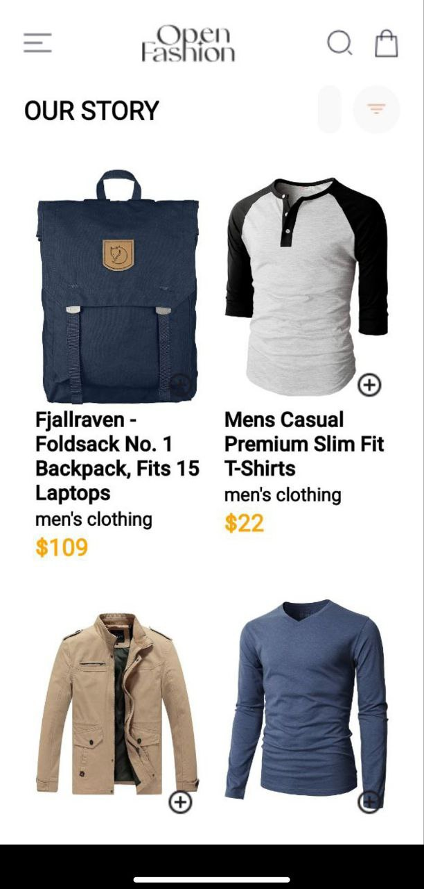
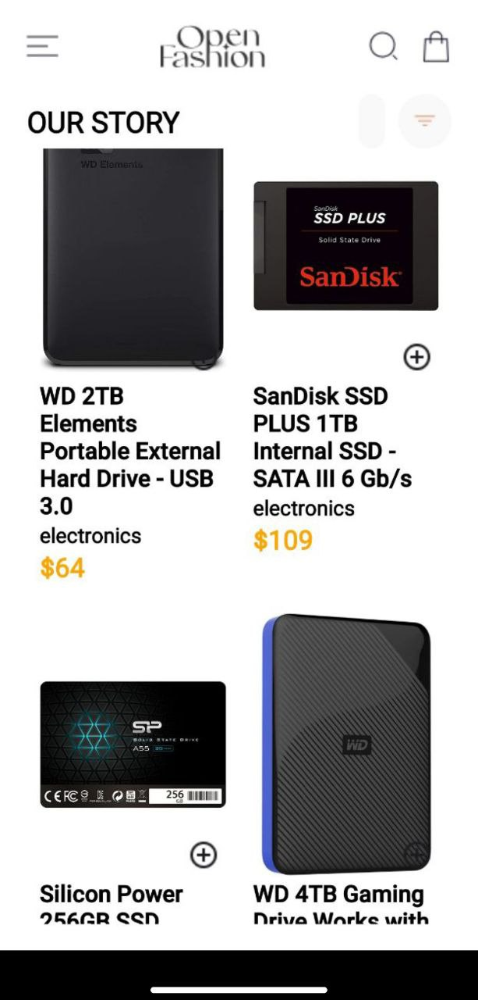
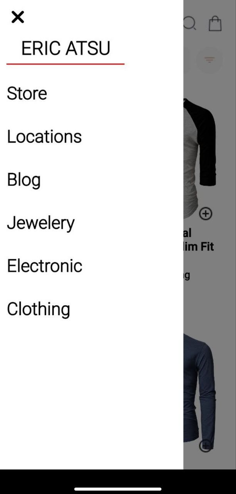
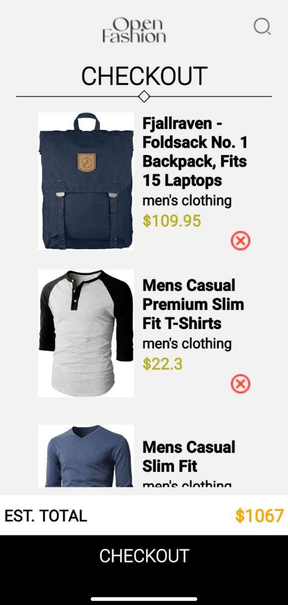
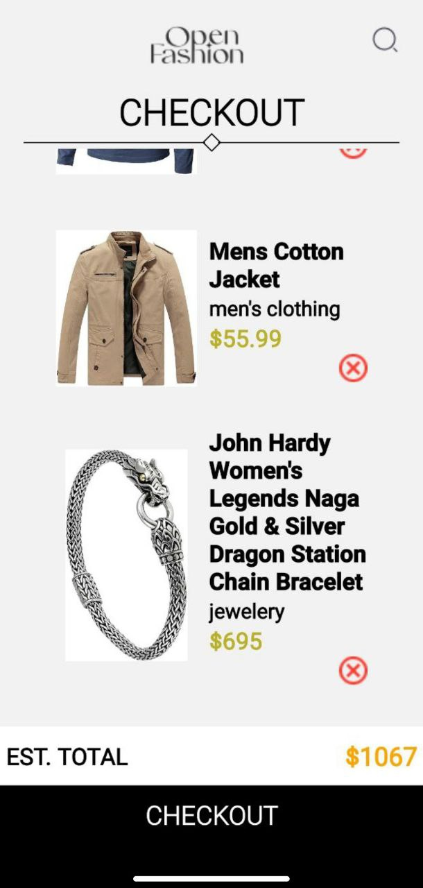
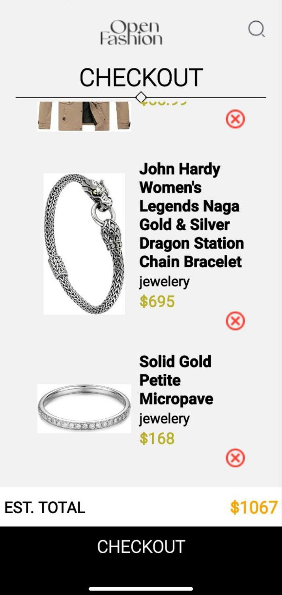

# DCIT202 Mobile Application Development Assignment 7

## Project Overview

This project expands on the previous assignment, incorporating additional features as outlined in the UI mockup. The application is a product catalog with detailed product information and a shopping cart feature. The app includes the following components:

- **Home**: Displays a list of available products fetched from an external API.
- **Product Detail**: Shows detailed information about a selected product.
- **Cart**: Displays items that have been added to the cart.
- **Drawer Navigation**: A navigation menu accessible through a swipe gesture or button.

## Features

- **Add to Cart**: Each product has a button to add it to the shopping cart.
- **Remove from Cart**: Each selected item in the cart can be removed.
- **Fetch Data**: Retrieves product data from an external API using `fetch`.
- **Asynchronous Operations**: Handles asynchronous operations with `async/await`.
- **Local Storage**: Utilizes `AsyncStorage` to store selected items locally on the device.

## Screenshots

### Home Screen

### Drawer

### Cart Screen

